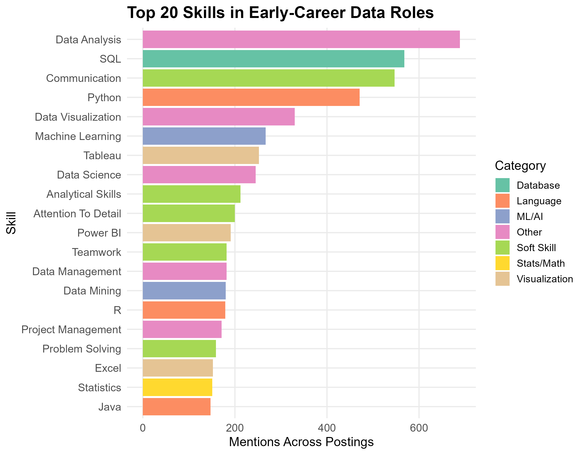
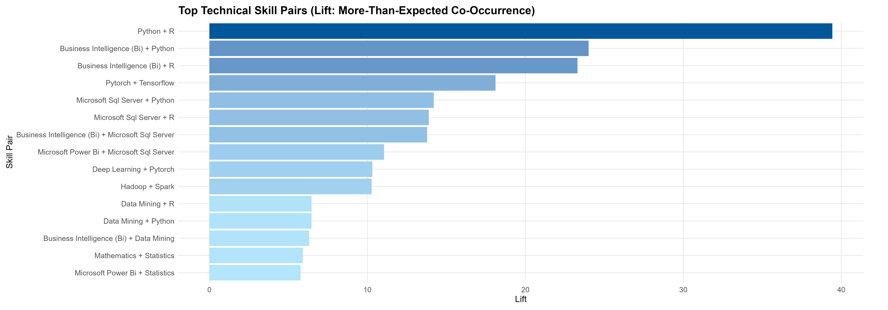

**Repo:** https://github.com/Lucas-Gates/internship_skill_analysis

### Problem
Early-career data roles have inconsistent job titles and messy skill labels. It’s hard to quickly understand what skills and “stacks” are most common for internships/entry-level roles.

### The Project
An end-to-end Python + R analysis pipeline that:
- merges job postings, extracted skills, and summaries using `job_link`
- filters for early-career roles (intern/new grad/entry-level keywords)
- normalizes skill labels using alias mapping + whitespace/case cleaning
- categorizes skills (Language/Database/Cloud/ML/DE/Viz/Stats/Soft Skills)
- computes skill co-occurrence and lift (association strength)
- generates polished R visuals for reporting

### Example outputs
- Category prevalence across postings (what % mention Databases, Visualization, etc.)
- Top skills (SQL, Python, etc.)
- Lift-based stacks

### Skills demonstrated
- Data pipeline engineering (joins, cleaning, reproducible outputs)
- Association analysis (lift) and support filtering
- R visualization (ggplot2) and communication

### Example Visualizations

