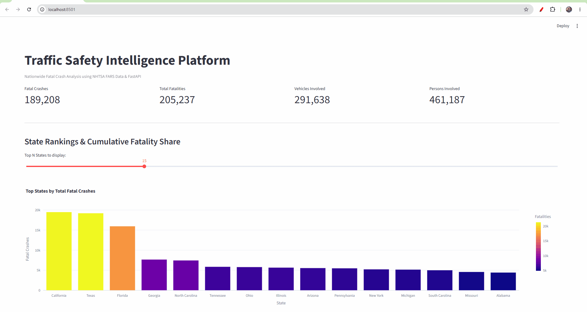

**Repo:** [https://github.com/Lucas-Gates/traffic-safety-intelligence](https://github.com/Lucas-Gates/traffic-safety-intelligence)

### Problem
Federal traffic safety records contain hundreds of thousands of fatal crash incidents annually, but the data is siloed across separate annual archives and disparate tabular files (crashes, vehicles, and occupants). Analyzing nationwide multi-year trends requires cleaning, standardizing, and structuring this data into an accessible format.

### What I built
An end-to-end data engineering platform that processes 900,000+ federal crash records from NHTSA FARS (2020–2024), loads them into a normalized relational database, and exposes analytics via an API and interactive dashboard.

- `src/etl/` handles automated retrieval, unzipping, standardizing, and loading of 5 years of crash archives
- `sql/schema.sql` defines the relational MySQL schema using composite primary and foreign keys
- `src/api/` runs a FastAPI REST service exposing structured analytics and summary endpoints
- `src/dashboard/` powers an interactive Streamlit UI for visual exploratory analysis
- `docker-compose.yml` orchestrates the database, API, and dashboard in isolated containers

### Key features
- Automated multi-year ETL pipeline processing 900k+ records across crashes, vehicles, and people
- Normalized relational database schema with composite keys `(year, st_case, veh_no, per_no)`
- Analytical SQL queries leveraging CTEs and window functions to uncover behavioral and temporal patterns
- Decoupled RESTful API backend serving aggregated metrics to downstream clients
- Interactive Streamlit dashboard with state rankings, time-of-day risk distributions, and vehicle comparisons
- Multi-container architecture orchestrated using Docker and Docker Compose

### Skills demonstrated
- Data engineering & ETL pipeline design (Python, Pandas)
- Relational database modeling & analytical SQL (MySQL 8.0)
- Backend API development (FastAPI, Uvicorn)
- Interactive data visualization (Streamlit, Plotly)
- Containerization & service orchestration (Docker, Docker Compose)